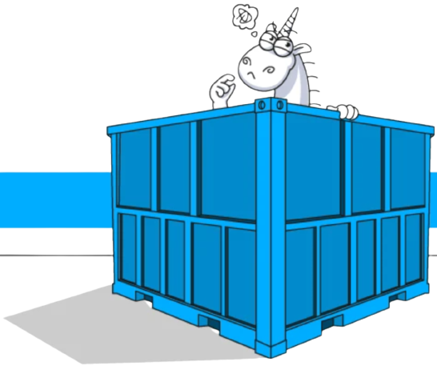

  

 

  
  
  
  

# ft_containers

This project is an implementation of the containers of the C++ standard library. The containers are implemented in C++98.

## Brief

The containers are implemented in the following order:

- [x] Vector
- [x] Map
- [x] Stack
- [ ] Queue
- [ ] Double ended queue
- [ ] Set
- [ ] Multiset
- [ ] Multimap

## References

### Vectors

- <http://www.cplusplus.com/reference/vector/vector/?kw=vector>
- <https://learn.microsoft.com/en-US/cpp/standard-library/vector-class?view=msvc-170&viewFallbackFrom=vs-2019>

### Lists

- <http://www.cplusplus.com/reference/list/list/?kw=list>
- <https://learn.microsoft.com/en-US/cpp/standard-library/list-class?view=msvc-170&viewFallbackFrom=vs-2019>

### Maps

- <http://www.cplusplus.com/reference/map/map/?kw=map>
- <https://learn.microsoft.com/en-US/cpp/standard-library/map-class?view=msvc-170&viewFallbackFrom=vs-2019>

### Stacks

- <http://www.cplusplus.com/reference/stack/stack/?kw=stack>
- <https://learn.microsoft.com/en-US/cpp/standard-library/stack-class?view=msvc-170&viewFallbackFrom=vs-2019>

### Queues

- <http://www.cplusplus.com/reference/queue/queue/?kw=queue>
- <https://learn.microsoft.com/en-US/cpp/standard-library/queue-class?view=msvc-170&viewFallbackFrom=vs-2019>

### Double ended queues

- <http://www.cplusplus.com/reference/deque/deque/?kw=deque>
- <https://learn.microsoft.com/en-US/cpp/standard-library/deque-class?view=msvc-170&viewFallbackFrom=vs-2019>

### Sets

- <http://www.cplusplus.com/reference/set/set/?kw=set>
- <https://learn.microsoft.com/en-US/cpp/standard-library/set-class?view=msvc-170&viewFallbackFrom=vs-2019>

### Multisets

- <http://www.cplusplus.com/reference/set/multiset/?kw=multiset>
- <https://learn.microsoft.com/en-US/cpp/standard-library/multiset-class?view=msvc-170&viewFallbackFrom=vs-2019>

### Multimaps

- <http://www.cplusplus.com/reference/map/multimap/?kw=multimap>
- <https://learn.microsoft.com/en-US/cpp/standard-library/multimap-class?view=msvc-170&viewFallbackFrom=vs-2019>

## License

This project is licensed under the Affero General Public License v3.0 - see the [LICENSE](LICENSE) file for details.
